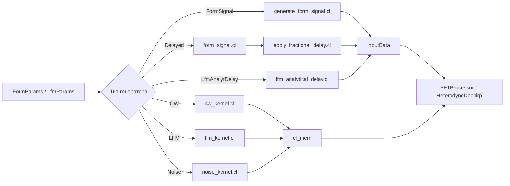

# Signal Generators — Полная документация

> Генерация сигналов на GPU: CW, LFM, LFM-conj, Noise, FormSignal, Script, DelayedFormSignal, LfmAnalyticalDelay

**Namespace**: `signal_gen`
**Каталог**: `signal_generators/`
**Зависимости**: core (`IBackend*`), OpenCL, ROCm (опционально, ENABLE_ROCM=1)

---

## Содержание

1. [Обзор и назначение](#1-обзор-и-назначение)
2. [Архитектура — семейство классов](#2-архитектура)
3. [Математика](#3-математика)
4. [Пошаговый pipeline](#4-пошаговый-pipeline)
5. [Kernels](#5-kernels)
6. [API — C++ и Python](#6-api)
7. [Тесты](#7-тесты)
8. [Диаграммы C1–C4](#8-диаграммы-c1c4)
9. [Ссылки + файловое дерево](#9-ссылки--файловое-дерево)
10. [Важные нюансы](#10-важные-нюансы)

---

## 1. Обзор и назначение

Модуль `signal_generators` генерирует комплексные (IQ) и вещественные сигналы на GPU (OpenCL / ROCm). Используется для моделирования сценариев ЦОС: тестовые векторы для FFT, дечирпа, фильтрации, формирования луча.

### Какой класс выбрать

| Класс | Для чего | Выход | Задержка |
|-------|----------|-------|----------|
| `FormSignalGenerator` | CW/Chirp + шум, N антенн | `InputData<cl_mem>` | FIXED/LINEAR/RANDOM per-channel |
| `FormScriptGenerator` | То же + on-disk кэш kernel | `InputData<cl_mem>` | То же |
| `DelayedFormSignalGenerator` | FormSignal + дробная задержка Farrow | `InputData<cl_mem>` | в мкс, float per-antenna |
| `LfmGeneratorAnalyticalDelay` | LFM с аналитической задержкой per-antenna | `InputData<cl_mem>` | в мкс, float per-antenna |
| `LfmConjugateGenerator` | conj(s_tx) — опорный сигнал для дечирпа | `cl_mem` | нет (tau=0) |
| `CwGenerator` | CW, multi-beam | `cl_mem` | нет |
| `LfmGenerator` | LFM chirp, multi-beam | `cl_mem` | нет |
| `NoiseGenerator` | Gaussian/White шум | `cl_mem` | нет |

**Быстрая шпаргалка выбора:**
```
Нужны N каналов + шум + LINE задержка?  → FormSignalGenerator
Нужно сохранить kernel на диск?          → FormScriptGenerator
Нужна дробная задержка (3.24 сэмпла)?   → DelayedFormSignalGenerator
Нужен LFM с задержкой без интерполяции? → LfmGeneratorAnalyticalDelay
Нужен опорный ЛЧМ для дечирпа?          → LfmConjugateGenerator
Нужен простой CW/LFM/Noise?             → CwGenerator/LfmGenerator/NoiseGenerator
```

---

## 2. Архитектура

### Иерархия классов

```
ISignalGenerator (interface)
    ├── CwGenerator          → cw_kernel.cl
    ├── LfmGenerator         → lfm_kernel.cl
    └── NoiseGenerator       → noise_kernel.cl + prng.cl

(standalone — свои методы API)
    ├── FormSignalGenerator              → form_signal.cl + prng.cl
    ├── FormScriptGenerator              → form_signal.cl + KernelCacheService
    ├── DelayedFormSignalGenerator       → form_signal.cl + delayed_form_signal.cl + prng.cl
    ├── LfmGeneratorAnalyticalDelay      → lfm_analytical_delay.cl
    ├── LfmConjugateGenerator            → lfm_conjugate.cl
    └── FormSignalGeneratorROCm          → form_signal.hip (ROCm, ENABLE_ROCM=1)
```

### Фасады / сервисы

```
SignalService          — фасад для CW/LFM/Noise: GenerateCpu/GenerateGpu
SignalGeneratorFactory — фабрика: CreateCw/CreateLfm/CreateNoise/CreateForm/Create(SignalRequest)
```

### Общий паттерн каждого класса

```
Constructor(IBackend*)  → захватить context/queue/device из backend
SetParams(Params)       → сохранить params_ (lazy compile)
Generate*()             → если kernel==nullptr → CompileKernel() → enqueue → результат
Destructor              → ReleaseGpuResources()
```

---

## 3. Математика

### 3.1 CW (Continuous Wave)

$$
s_{CW}(t) = A \cdot e^{j(2\pi f_0 t + \phi_0)}
$$

Multi-beam: $f_i = f_0 + i \cdot \Delta f$, $i = 0, 1, \ldots, N_{beams}-1$

**Параметры**: `CwParams` — `f0`, `amplitude`, `phase`, `freq_step`

### 3.2 LFM (Linear Frequency Modulation)

$$
s_{LFM}(t) = A \cdot e^{j(\pi k t^2 + 2\pi f_{start} t)}
$$

где скорость чирпа:

$$
k = \frac{f_{end} - f_{start}}{T}
$$

**Параметры**: `LfmParams` — `f_start`, `f_end`, `amplitude`, `complex_iq`

### 3.3 LfmConjugate (опорный сигнал дечирпа)

$$
s_{ref}^*(t) = e^{-j(\pi k t^2 + 2\pi f_{start} t)}
$$

Используется в дечирпе: $s_{dc}(t) = s_{rx}(t) \cdot s_{ref}^*(t)$

### 3.4 Noise (Gaussian)

**Philox-2x32-10 PRNG** + **Box-Muller**:

$$
n(t) = \sigma \cdot \sqrt{-2 \ln u_1} \cdot e^{j 2\pi u_2}
$$

где $u_1, u_2 \in (0,1]$ — uniform из Philox, $\sigma = \sqrt{P_{noise}}$.

**Параметры**: `NoiseParams` — `type` (GAUSSIAN/WHITE), `power`, `seed`

### 3.5 FormSignal — формула getX

$$
X(t) = a \cdot \text{norm} \cdot e^{j\phi(t)} + a_n \cdot \text{norm} \cdot (n_r + j n_i)
$$

$$
\phi(t) = 2\pi f_0 t + \frac{\pi f_{dev}}{t_i} \left(t - \frac{t_i}{2}\right)^2 + \phi_0
$$

**Окно**: $X = 0$ если $t < 0$ или $t > t_i - dt$, где $t_i = N_{points}/f_s$, $dt = 1/f_s$.

**Задержки** per-channel через `tau`:

| Режим | Условие | Формула tau для канала ID |
|-------|---------|--------------------------|
| FIXED | `tau_step=0`, `tau_min=tau_max` | `tau = tau_base` |
| LINEAR | `tau_step > 0` | `tau = tau_base + ID * tau_step` |
| RANDOM | `tau_min != tau_max` | `tau = tau_min + Philox_uniform() * (tau_max - tau_min)` |

Задержка `tau` сдвигает окно: $t_{eff} = t_{sample} + \tau$.

### 3.6 LfmAnalyticalDelay — LFM с аналитической задержкой

$$
S_{delayed}(t) = A \cdot e^{j(\pi k \cdot t_{local}^2 + 2\pi f_{start} \cdot t_{local})}
$$

где $t_{local} = t - \tau$, и $S = 0$ при $t < \tau$.

Идеальная задержка — без интерполяционных артефактов.

### 3.7 DelayedFormSignal — задержка Farrow 48×5

**Три шага**:
1. Генерация чистого сигнала $x[n]$ (getX без шума)
2. Дробная задержка: $y[n] = \sum_{k=0}^{4} h_k[f] \cdot x[n - D - k + 2]$, где $D$ — целый сдвиг, $f$ — дробная часть задержки (из 48 строк матрицы Lagrange)
3. Добавление шума $y[n] + a_n \cdot \text{norm} \cdot (n_r + j n_i)$ (Philox+Box-Muller)

Матрица Lagrange 48×5 — предвычисленные коэффициенты интерполяции для 48 субпикселей (шаг 1/48 сэмпла). Загружается из JSON или используется встроенная.

---

## 4. Пошаговый pipeline

### 4.1 FormSignalGenerator

```
INPUT: FormParams (fs, f0, fdev, amplitude, noise_amplitude, tau_*, antennas, points)
    │
    ▼
┌─────────────────────────────────────────────────────┐
│ 1. CompileKernel() [при первом вызове]              │
│    prng.cl + form_signal.cl → cl_program            │
│    compile flags: -cl-fast-relaxed-math             │
└─────────────────────────────────────────────────────┘
    │
    ▼
┌─────────────────────────────────────────────────────┐
│ 2. Allocate cl_mem                                  │
│    size = antennas * points * sizeof(complex<float>)│
└─────────────────────────────────────────────────────┘
    │
    ▼
┌─────────────────────────────────────────────────────┐
│ 3. generate_form_signal kernel (GPU)                │
│    global_size = antennas * points                  │
│    per-thread: вычислить tau(ID), getX(t + tau)    │
│    шум: Philox(seed + thread_id) → Box-Muller       │
└─────────────────────────────────────────────────────┘
    │
    ▼
OUTPUT: InputData<cl_mem>
        .data          = cl_mem (caller owns, must clReleaseMemObject)
        .antenna_count = antennas
        .n_point       = points
        .gpu_memory_bytes = antennas*points*8
```

### 4.2 DelayedFormSignalGenerator

```
INPUT: FormParams + delay_us[] (задержки в мкс per-antenna)
    │
    ▼
┌──────────────────────────────────────────────────┐
│ 1. FormSignalGenerator::GenerateInputData()      │  → form_signal.cl (noise=0)
│    Чистый сигнал: antennas*points complex        │
└──────────────────────────────────────────────────┘
    │
    ▼
┌──────────────────────────────────────────────────┐
│ 2. apply_fractional_delay kernel                 │  → delayed_form_signal.cl
│    Для каждой антенны:                           │
│    D = floor(delay_us * fs / 1e6)                │
│    f = frac(delay_us * fs / 1e6)                 │
│    row = round(f * 48) → Lagrange[row] (5 коэф) │
│    y[n] = sum(h[k] * x[n-D-k+2], k=0..4)        │
└──────────────────────────────────────────────────┘
    │
    ▼
┌──────────────────────────────────────────────────┐
│ 3. Добавление шума (если noise_amplitude > 0)    │  → prng.cl (Philox+Box-Muller)
│    y[n] += an*norm*(nr + j*ni)                   │
└──────────────────────────────────────────────────┘
    │
    ▼
OUTPUT: InputData<cl_mem> (caller owns)
```

### 4.3 LfmGeneratorAnalyticalDelay

```
INPUT: LfmParams + SystemSampling + delay_us[] per-antenna
    │
    ▼
┌──────────────────────────────────────────────────┐
│ 1. lfm_analytical_delay kernel (GPU)             │
│    global_size = antennas * length               │
│    t_local = t - tau_ant                         │
│    if t_local < 0 → output = 0                   │
│    else → s = A*exp(j*(pi*k*t_local^2 + ...))   │
└──────────────────────────────────────────────────┘
    │
    ▼
OUTPUT: InputData<cl_mem>
```

### 4.4 Mermaid — общий pipeline



---

## 5. Kernels

### 5.1 cw_kernel.cl

**Функция**: `generate_cw`

| Аргумент | Тип | Описание |
|----------|-----|----------|
| `output` | `__global float2*` | Выходной буфер |
| `f0` | `float` | Несущая частота |
| `amplitude` | `float` | Амплитуда |
| `phase` | `float` | Начальная фаза |
| `freq_step` | `float` | Шаг частоты (multi-beam) |
| `fs` | `float` | Частота дискретизации |
| `n_point` | `uint` | Отсчётов на луч |
| `beam_count` | `uint` | Число лучей |

```c
int beam   = gid / n_point;
int sample = gid % n_point;
float freq  = f0 + beam * freq_step;
float t     = (float)sample / fs;
float angle = 2.0f * M_PI_F * freq * t + phase;
output[gid] = (float2)(amplitude * cos(angle), amplitude * sin(angle));
```

### 5.2 lfm_kernel.cl

**Функция**: `generate_lfm`

Формула: $s[n] = A \cdot e^{j(\pi k n^2/f_s^2 + 2\pi f_{start} n/f_s)}$

| Аргумент | Тип | Описание |
|----------|-----|----------|
| `output` | `__global float2*` | Выходной буфер |
| `f_start` | `float` | Начальная частота |
| `chirp_rate` | `float` | $k = (f_{end} - f_{start})/T$ |
| `amplitude` | `float` | Амплитуда |
| `fs` | `float` | Частота дискретизации |
| `n_point` | `uint` | Отсчётов на луч |
| `beam_count` | `uint` | Число лучей |

### 5.3 noise_kernel.cl

**Функция**: `generate_noise_gaussian`

Требует `prng.cl` (Philox-2x32-10). Каждый thread генерирует пару $(n_{re}, n_{im})$ через Box-Muller.

| Аргумент | Тип | Описание |
|----------|-----|----------|
| `output` | `__global float2*` | Выходной буфер |
| `seed` | `uint` | Начальное состояние PRNG |
| `std_dev` | `float` | $\sigma = \sqrt{power}$ |
| `n_total` | `uint` | Всего отсчётов |

### 5.4 prng.cl — общий PRNG (Philox + Box-Muller)

Не самостоятельный kernel — **конкатенируется** перед `noise_kernel.cl`, `form_signal.cl`, `delayed_form_signal.cl` при компиляции.

```c
// Philox-2x32-10: 10 раундов перемешивания
uint2 philox2x32_10(uint2 ctr, uint2 key);

// Uniform [0,1) из потока thread_id с seed и counter
float philox_uniform(uint thread_id, uint seed, uint counter);
```

### 5.5 form_signal.cl

**Функция**: `generate_form_signal` — getX + tau_mode + шум

| Аргумент | Тип | Описание |
|----------|-----|----------|
| `output` | `__global float2*` | antennas × points |
| `fs`, `f0`, `fdev` | `double` | Частоты |
| `amplitude`, `norm` | `double` | Амплитуды |
| `noise_amplitude` | `double` | Шум |
| `noise_seed` | `uint` | Seed шума |
| `phase` | `double` | Начальная фаза |
| `tau_base`, `tau_step` | `double` | Задержки LINEAR (секунды) |
| `tau_min`, `tau_max` | `double` | Задержки RANDOM (секунды) |
| `tau_seed` | `uint` | Seed для tau RANDOM |
| `antennas`, `points` | `uint` | Размерность |
| `tau_mode` | `int` | 0=FIXED, 1=LINEAR, 2=RANDOM |

```c
int antenna_id = gid / points;
int sample_id  = gid % points;
double tau = compute_tau(antenna_id, tau_mode, ...);
double t   = (double)sample_id / fs + tau;
double ti  = (double)points / fs;
if (t < 0.0 || t > ti - 1.0/fs) { output[gid] = 0; return; }
double t_c = t - ti * 0.5;
double ph  = 2*M_PI*f0*t + M_PI*fdev/ti*t_c*t_c + phase;
output[gid] = (float2)(amplitude*norm*cos(ph) + noise_re,
                        amplitude*norm*sin(ph) + noise_im);
```

### 5.6 delayed_form_signal.cl

**Функция**: `apply_fractional_delay` — Lagrange 48×5

| Аргумент | Тип | Описание |
|----------|-----|----------|
| `input` | `__global float2*` | Чистый сигнал (без шума) |
| `output` | `__global float2*` | Выход с задержкой + шум |
| `delays_samples` | `__global float*` | Задержки в сэмплах per-antenna |
| `lagrange_matrix` | `__constant float*` | 48×5 коэффициенты |
| `antennas`, `points` | `uint` | Размерность |
| `noise_amplitude` | `float` | Шум после задержки |
| `noise_seed` | `uint` | Seed шума |

Алгоритм: `D = (int)delay_s`, `frac = delay_s - D`, `row = round(frac * 48)`, 5-точечная Lagrange interpolation.

### 5.7 lfm_analytical_delay.cl

**Функция**: `generate_lfm_analytical_delay`

$t_{local} = t - \tau_{ant}$; если $t_{local} < 0$ → нуль. Иначе $s = A \cdot e^{j(\pi k t_{local}^2 + 2\pi f_{start} t_{local})}$.

### 5.8 lfm_conjugate.cl

**Функция**: `generate_lfm_conjugate`

Сопряжённый ЛЧМ: $s^*(t) = e^{-j(\pi k t^2 + 2\pi f_{start} t)}$. Используется в `HeterodyneDechirp`.

### 5.9 form_signal.hip (ROCm)

Inline HIP kernel в `FormSignalGeneratorROCm`. Аналогичен `form_signal.cl`, компилируется через hiprtc. Доступен только при `ENABLE_ROCM=1`.

---

## 6. API

### 6.1 C++ — CwGenerator

```cpp
#include "generators/cw_generator.hpp"

signal_gen::CwParams cw;
cw.f0 = 1e6;        // 1 МГц
cw.amplitude = 1.0;
cw.phase = 0.0;
cw.freq_step = 0.0; // multi-beam: шаг по частоте

signal_gen::SystemSampling sys{12e6, 4096};
signal_gen::CwGenerator gen(backend, cw);

cl_mem buf = gen.GenerateToGpu(sys, /*beam_count=*/1);  // caller owns
// ...
clReleaseMemObject(buf);

std::vector<std::complex<float>> cpu(sys.length);
gen.GenerateToCpu(sys, cpu.data(), cpu.size());
```

### 6.2 C++ — LfmGenerator

```cpp
#include "generators/lfm_generator.hpp"

signal_gen::LfmParams lfm;
lfm.f_start = 1e6;  lfm.f_end = 2e6;  lfm.amplitude = 1.0;

signal_gen::LfmGenerator gen(backend, lfm);
cl_mem buf = gen.GenerateToGpu({12e6, 4096}, 1);
clReleaseMemObject(buf);
```

### 6.3 C++ — NoiseGenerator

```cpp
#include "generators/noise_generator.hpp"

signal_gen::NoiseParams np;
np.type = signal_gen::NoiseType::GAUSSIAN;
np.power = 1.0;  np.seed = 42;

signal_gen::NoiseGenerator gen(backend, np);
cl_mem buf = gen.GenerateToGpu({12e6, 4096}, 1);
clReleaseMemObject(buf);
```

### 6.4 C++ — FormSignalGenerator

```cpp
#include "generators/form_signal_generator.hpp"

signal_gen::FormParams p;
p.fs = 12e6;  p.f0 = 1e6;  p.fdev = 0.0;  // CW; fdev!=0 → chirp
p.antennas = 8;  p.points = 4096;
p.amplitude = 1.0;  p.noise_amplitude = 0.1;
p.tau_step = 1e-5;  // LINEAR: 10 мкс между каналами (в секундах!)

signal_gen::FormSignalGenerator gen(backend);
gen.SetParams(p);

auto input = gen.GenerateInputData();   // InputData<cl_mem>
clReleaseMemObject(input.data);         // caller owns!

auto cpu = gen.GenerateToCpu();         // vector<vector<complex<float>>>

// Из строки
gen.SetParamsFromString("f0=1e6,a=1.0,an=0.1,antennas=8,points=4096,fs=12e6");
```

### 6.5 C++ — DelayedFormSignalGenerator

```cpp
#include "generators/delayed_form_signal_generator.hpp"

signal_gen::FormParams p;
p.fs = 12e6;  p.f0 = 1e6;
p.antennas = 8;  p.points = 4096;
p.amplitude = 1.0;
p.noise_amplitude = 0.1;  // шум добавляется ПОСЛЕ задержки

signal_gen::DelayedFormSignalGenerator gen(backend);
gen.SetParams(p);
gen.SetDelays({0.0f, 1.5f, 3.0f, 4.5f, 6.0f, 7.5f, 9.0f, 10.5f}); // мкс!

// Опционально: загрузить матрицу из JSON
// gen.LoadMatrix("path/to/lagrange_48x5.json");

auto input = gen.GenerateInputData();
clReleaseMemObject(input.data);
```

### 6.6 C++ — LfmGeneratorAnalyticalDelay

```cpp
#include "generators/lfm_generator_analytical_delay.hpp"

signal_gen::LfmParams params;
params.f_start = 1e6;  params.f_end = 2e6;  params.amplitude = 1.0;

signal_gen::LfmGeneratorAnalyticalDelay gen(backend, params);
gen.SetSampling({12e6, 4096});
gen.SetDelays({0.0f, 2.7f, 5.4f});  // мкс, 3 антенны

auto result = gen.GenerateToGpu();
clReleaseMemObject(result.data);

auto cpu = gen.GenerateToCpu();  // vector<vector<complex<float>>>
```

### 6.7 C++ — LfmConjugateGenerator

```cpp
#include "generators/lfm_conjugate_generator.hpp"

signal_gen::LfmConjugateGenerator gen(backend, lfm_params);
gen.SetSampling({12e6, 4096});

cl_mem ref = gen.GenerateToGpu();  // conj(s_tx), для HeterodyneDechirp
clReleaseMemObject(ref);
```

### 6.8 C++ — FormScriptGenerator

```cpp
#include "generators/form_script_generator.hpp"

signal_gen::FormScriptGenerator gen(backend);
gen.SetParams(p);

// Режим 1: компиляция + сохранение (~50 мс)
gen.Compile();
auto input = gen.GenerateInputData();
gen.SaveKernel("radar_8ch", "CW 1MHz 8 channels");
clReleaseMemObject(input.data);

// Режим 2: загрузка с кэша (~1 мс)
gen.LoadKernel("radar_8ch");
auto input2 = gen.GenerateInputData();

std::string script = gen.GenerateScript();  // DSL-текст
auto names = gen.ListKernels();             // список кешированных
bool ready = gen.IsReady();
```

### 6.9 C++ — SignalService / SignalGeneratorFactory

```cpp
#include <signal_generators/signal_service.hpp>
#include <signal_generators/signal_generator_factory.hpp>

// SignalService: фасад
signal_gen::SignalService service(backend);
auto cpu_cw  = service.GenerateCpu(cw_params, {12e6, 4096});
auto gpu_buf = service.GenerateGpu(lfm_params, {12e6, 4096}, 1);
clReleaseMemObject(gpu_buf);

// Factory: создать по типу
auto gen = signal_gen::SignalGeneratorFactory::CreateCw(backend, cw_params);
auto gen2 = signal_gen::SignalGeneratorFactory::Create(backend, signal_request);
```

### 6.10 Python — FormSignalGenerator

```python
import dsp_signal_generators
import numpy as np

ctx = dsp_signal_generators.ROCmGPUContext(0)
gen = dsp_signal_generators.FormSignalGeneratorROCm(ctx)

gen.set_params(
    fs=12e6, f0=1e6, fdev=0.0,
    antennas=8, points=4096,
    amplitude=1.0, noise_amplitude=0.1,
    tau_step=1e-5        # LINEAR: 10 мкс (в секундах!)
)

data = gen.generate()    # (8, 4096) complex64
print(data.shape, data.dtype)

gen.set_params_from_string("f0=1e6,a=1.0,an=0.1,antennas=8,points=4096,fs=12e6")
data2 = gen.generate()
```

### 6.11 Python — DelayedFormSignalGenerator

```python
gen = dsp_signal_generators.DelayedFormSignalGeneratorROCm(ctx)
gen.set_params(
    fs=1e6, f0=50000,
    antennas=8, points=4096,
    amplitude=1.0, noise_amplitude=0.0
)
gen.set_delays([0.0, 1.5, 3.0, 4.5, 6.0, 7.5, 9.0, 10.5])  # мкс!
data = gen.generate()   # (8, 4096) complex64
```

### 6.12 Python — LfmAnalyticalDelay

```python
gen = dsp_signal_generators.LfmAnalyticalDelay(ctx)
gen.set_params(f_start=1e6, f_end=2e6, amplitude=1.0)
gen.set_sampling(fs=12e6, length=4096)
gen.set_delays([0.0, 2.7, 5.4])   # мкс, 3 антенны

cpu_data = gen.generate_cpu()     # list of np.ndarray (3 штуки)
gpu_data = gen.generate_gpu()     # то же, через readback с GPU
```

### 6.13 Python — FormScriptGenerator

```python
gen = dsp_signal_generators.FormScriptGenerator(ctx)
gen.set_params(fs=10e6, f0=1e6, antennas=16, points=8192, noise_amplitude=0.05)
gen.compile()
gen.save_kernel("radar_16ch", "16-channel CW 1 MHz")
data = gen.generate()   # (16, 8192) complex64

# Загрузка кэша
gen2 = dsp_signal_generators.FormScriptGenerator(ctx)
gen2.set_params(fs=10e6, f0=1e6, antennas=16, points=8192)
gen2.load_kernel("radar_16ch")
data2 = gen2.generate()

print(gen.generate_script())   # DSL-текст kernel
print(gen.list_kernels())      # ['radar_16ch', ...]
```

---

## 7. Тесты

### 7.1 C++ тесты

| # | ID | Файл | Что проверяет | Параметры | Порог |
|---|----|------|---------------|-----------|-------|
| 1 | SG-1 | test_signal_generators.hpp | CW: GPU vs CPU | f0=250 Hz, A=1.5, fs=4 kHz, N=4096 | max_err < 1e-3 |
| 2 | SG-2 | test_signal_generators.hpp | CW multi-beam: 8 лучей | f0=100, beams=8, freq_step=50 Hz | max_err < 1e-3 каждый луч |
| 3 | SG-3 | test_signal_generators.hpp | LFM: GPU vs CPU reference | f_start=100, f_end=500 Hz | max_err < 1e-3 |
| 4 | SG-4 | test_signal_generators.hpp | Noise: mean~0, var~power | N=100000, power=2.0, seed=42 | \|mean\|<0.1, \|var-2.0\|<0.2 |
| 5 | SG-5 | test_signal_generators.hpp | CW→FFT: частота пика точная | f0=300 Hz, fs=4 kHz, N=4096 | error < 1 bin (~0.98 Hz) |
| 6 | SG-6 | test_signal_generators.hpp | Factory: виды создаются правильно | SignalRequest CW/LFM/Noise | Kind() == ожидаемый |
| 7 | FS-1 | test_form_signal.hpp | FormSignal без шума: GPU vs getX(CPU) | f0=1e6, A=1.0, fs=12 MHz, N=4096 | max_err < 1e-3 |
| 8 | FS-2 | test_form_signal.hpp | Окно: нули при tau выходит за пределы | tau=-0.1 s, fs=1 kHz, N=1000 | 99/100 нулей в [0..99] |
| 9 | FS-3 | test_form_signal.hpp | Multi-channel 8 антенн + TAU_STEP | antennas=8, tau_step=1e-4 | корректные сдвиги |
| 10 | FS-4 | test_form_signal.hpp | Noise: mean~0, variance~(an*norm)^2 | an=1.0, N=100000 | \|mean\|<0.1, \|var-0.5\|<0.05 |
| 11 | FS-5 | test_form_signal.hpp | FormParams парсер из строки | "f0=1e6,a=1.0,..." | params корректные |
| 12 | FS-6 | test_form_signal.hpp | Chirp (fdev!=0): GPU vs CPU reference | fdev=5000, f0=1e6 | max_err < 1e-3 |
| 13 | FSc-1 | test_form_script.hpp | DSL GenerateScript() содержит ключи | f0=1e6, antennas=4 | contains "f0", "fs", "points" |
| 14 | FSc-2 | test_form_script.hpp | Compile+Generate vs FormSignalGenerator | f0=1e6, antennas=8, N=4096 | max_err < 1e-3 |
| 15 | FSc-3 | test_form_script.hpp | SaveKernel: файлы .cl + binary + manifest | name="test_kernel" | файлы существуют |
| 16 | FSc-4 | test_form_script.hpp | LoadKernel: тот же результат | name="test_kernel" | max_err < 1e-5 |
| 17 | FSc-5 | test_form_script.hpp | Versioning: коллизия → _00 файлы | повторный SaveKernel | файлы _00 созданы |
| 18 | FSc-6 | test_form_script.hpp | ListKernels из manifest.json | — | имена из manifest |
| 19 | FSc-7 | test_form_script.hpp | Chirp+noise через FormScript | fdev=5000, an=0.1 | max_err < 2e-3 |
| 20 | DS-1 | test_delayed_form_signal.hpp | Целая задержка: GPU vs CPU shift | delay_us=10.0 (целое при fs=1 MHz) | max_err < 1e-3 |
| 21 | DS-2 | test_delayed_form_signal.hpp | Дробная задержка: GPU vs CPU Lagrange | delay_us=3.24 | max_err < 0.05 |
| 22 | DS-3 | test_delayed_form_signal.hpp | Multi-channel 4 антенны, разные задержки | delays={0,1,2,3} мкс | корректная фазировка |
| 23 | DS-4 | test_delayed_form_signal.hpp | Нулевая задержка = FormSignalGenerator | delay=0 для всех | max_err < 1e-5 |
| 24 | LA-1 | test_lfm_analytical_delay.hpp | Zero delay = стандартный LfmGenerator | delay=0, fs=12 MHz, N=4096 | max_err < 1e-3 |
| 25 | LA-2 | test_lfm_analytical_delay.hpp | Первый ненулевой на правильном индексе | delay=3.24 мкс, fs=12 MHz | index = floor(3.24*12) |
| 26 | LA-3 | test_lfm_analytical_delay.hpp | GPU vs CPU reference | f_start=1 MHz, f_end=2 MHz | max_err < 1e-3 |
| 27 | LA-4 | test_lfm_analytical_delay.hpp | Multi-antenna: 3 антенны разные задержки | delays={0, 2.7, 5.4} мкс | каждая антенна корректна |

**Почему такие пороги**: OpenCL `-cl-fast-relaxed-math` даёт max ULP-ошибку в sin/cos до ~1e-3 (не 1e-6 как у CPU). Пороги выбраны с запасом, но достаточно строгими для catch реальных ошибок алгоритма.

**Почему такие входные данные**:
- CW с f0=250 Hz, fs=4 kHz: частота = 1/16 fs → период ровно 16 сэмплов, легко верифицировать
- LFM f_start=100, f_end=500, fs=4 kHz: chirp_rate = 400/T, мгновенная частота монотонно растёт
- Noise power=2.0, N=100000: при N→∞ mean→0, var→power; N=100k даёт точность ~1%
- FormSignal tau=-0.1 s: умышленно выход за окно, проверяет boundary condition
- DelayedForm delay=3.24 мкс: нецелое число сэмплов при fs=1 MHz → дробная часть = 0.24, row=round(0.24*48)=12

### 7.2 Python тесты

| # | Файл | Функция | Что проверяет | Порог |
|---|------|---------|---------------|-------|
| 1 | test_form_signal.py | test_no_noise | FormSignal vs NumPy getX | max_err < 1e-3 |
| 2 | test_form_signal.py | test_window | Нули за пределами окна | ≥99% нулей |
| 3 | test_form_signal.py | test_multi_channel | 8 каналов + TAU_STEP | корректный сдвиг |
| 4 | test_form_signal.py | test_noise_stats | mean~0, var~(an*norm)^2 | \|mean\|<0.05 |
| 5 | test_form_signal.py | test_params_string | set_params_from_string | params OK |
| 6 | test_form_signal.py | test_chirp | fdev!=0: мгновенная частота | bin error < 2 |
| 7 | test_form_signal.py | test_gpu_output | generate(output='gpu') | shape OK |
| 8 | test_delayed_form_signal.py | test_integer_delay | Целая задержка | max_err < 1e-3 |
| 9 | test_delayed_form_signal.py | test_fractional_delay | Дробная задержка Farrow | max_err < 0.05 |
| 10 | test_delayed_form_signal.py | test_multi_channel | 4 антенны | фазировка |
| 11 | test_delayed_form_signal.py | test_zero_delay | = FormSignalGenerator | max_err < 1e-4 |
| 12 | test_delayed_form_signal.py | test_noise_after_delay | Шум добавляется после | stats |
| 13 | test_lfm_analytical_delay.py | test_zero_delay | = LfmGenerator | max_err < 1e-3 |
| 14 | test_lfm_analytical_delay.py | test_boundary | Ненулевой с правильного индекса | index OK |
| 15 | test_lfm_analytical_delay.py | test_gpu_vs_cpu | GPU vs CPU | max_err < 1e-3 |
| 16 | test_lfm_analytical_delay.py | test_multi_antenna | 3 антенны | задержки OK |
| 17 | test_lfm_analytical_delay.py | test_plots | Визуализация в Results/Plots/ | — |

---

## 8. Диаграммы C1–C4

### C1 — System Context

```
┌────────────────────────────────────────────────────────────┐
│                    DSP-GPU System                       │
│                                                            │
│  [signal_generators]  ─────────────────────────────────►  │
│    Генерация тест-векторов           [FFTProcessor]        │
│    и опорных сигналов                [HeterodyneDechirp]   │
│    для downstream-модулей            [SpectrumMaximaFinder] │
│                                      [Filters]             │
└────────────────────────────────────────────────────────────┘
         │
    core IBackend* → GPU Hardware (OpenCL / ROCm)
```

### C2 — Container

```
┌─────────────────────────────────────────────────────────────┐
│  signal_generators module                                   │
│                                                             │
│  ┌────────────────────────────────────────────────────┐    │
│  │ ISignalGenerator hierarchy                         │    │
│  │ CwGenerator / LfmGenerator / NoiseGenerator        │    │
│  │ GenerateToGpu(SystemSampling) → cl_mem             │    │
│  └────────────────────────────────────────────────────┘    │
│                                                             │
│  ┌────────────────────────────────────────────────────┐    │
│  │ FormSignalGenerator                                │    │
│  │ getX multi-channel → InputData<cl_mem>             │    │
│  └────────────────────────────────────────────────────┘    │
│                                                             │
│  ┌────────────────────────────────────────────────────┐    │
│  │ FormScriptGenerator                                │    │
│  │ FormSignalGen + KernelCacheService (from core)   │    │
│  └────────────────────────────────────────────────────┘    │
│                                                             │
│  ┌────────────────────────────────────────────────────┐    │
│  │ DelayedFormSignalGenerator                         │    │
│  │ FormSignalGen + Lagrange 48×5 + Noise              │    │
│  └────────────────────────────────────────────────────┘    │
│                                                             │
│  ┌────────────────────────────────────────────────────┐    │
│  │ LfmGeneratorAnalyticalDelay                        │    │
│  │ LFM + per-antenna analytical delay (no interp)     │    │
│  └────────────────────────────────────────────────────┘    │
│                                                             │
│  ┌────────────────────────────────────────────────────┐    │
│  │ LfmConjugateGenerator                              │    │
│  │ conj(s_tx) → cl_mem (для HeterodyneDechirp)        │    │
│  └────────────────────────────────────────────────────┘    │
│                                                             │
│  ┌────────────────────────────────────────────────────┐    │
│  │ FormSignalGeneratorROCm  [ENABLE_ROCM=1]           │    │
│  │ FormSignalGen на HIP/hiprtc                        │    │
│  └────────────────────────────────────────────────────┘    │
│                                                             │
│  ┌────────────────────────────────────────────────────┐    │
│  │ SignalService (facade) + SignalGeneratorFactory     │    │
│  └────────────────────────────────────────────────────┘    │
│                                                             │
│         ↓ core IBackend*        ↓ kernels/*.cl/.hip      │
└─────────────────────────────────────────────────────────────┘
```

### C3 — Component

```
signal_gen namespace
│
├── ISignalGenerator (interface)
│   ├── + GenerateToCpu(SystemSampling, out*, size)
│   ├── + GenerateToGpu(SystemSampling, beam_count) → cl_mem
│   └── + Kind() → SignalKind
│       ├── CwGenerator    ← cw_kernel.cl
│       ├── LfmGenerator   ← lfm_kernel.cl
│       └── NoiseGenerator ← noise_kernel.cl ⊕ prng.cl
│
├── FormSignalGenerator
│   ├── + GenerateInputData() → InputData<cl_mem>
│   ├── + GenerateInputData(ProfEvents*) → InputData<cl_mem>
│   ├── + GenerateToCpu() → vector<vector<complex<float>>>
│   └── - CompileKernel() ← form_signal.cl ⊕ prng.cl
│
├── FormScriptGenerator
│   ├── + Compile() / SaveKernel() / LoadKernel() / ListKernels()
│   ├── + GenerateInputData() → InputData<cl_mem>
│   └── - kernel_cache_: KernelCacheService
│
├── DelayedFormSignalGenerator
│   ├── + SetDelays(vector<float> delay_us)
│   ├── + LoadMatrix(json_path)
│   ├── + GenerateInputData() → InputData<cl_mem>
│   ├── - signal_gen_: FormSignalGenerator  (step 1: clean signal)
│   └── - CompileDelayKernel() ← delayed_form_signal.cl
│
├── LfmGeneratorAnalyticalDelay
│   ├── + SetSampling(SystemSampling)
│   ├── + SetDelays(vector<float> delay_us)
│   ├── + GenerateToGpu() → InputData<cl_mem>
│   └── - CompileKernel() ← lfm_analytical_delay.cl
│
├── LfmConjugateGenerator
│   ├── + SetSampling(SystemSampling)
│   ├── + GenerateToGpu() → cl_mem
│   └── - CompileKernel() ← lfm_conjugate.cl
│
├── SignalService
│   ├── + GenerateCpu(Params, SystemSampling) → vector<complex<float>>
│   └── + GenerateGpu(Params, SystemSampling, beams) → cl_mem
│
└── SignalGeneratorFactory
    ├── + CreateCw / CreateLfm / CreateNoise / CreateForm
    └── + Create(IBackend*, SignalRequest)
```

### C4 — Code (ключевые классы)

```
FormSignalGenerator
  + FormSignalGenerator(IBackend* backend)
  + SetParams(const FormParams&)
  + SetParamsFromString(const string&)
  + GenerateInputData() → InputData<cl_mem>
  + GenerateInputData(ProfEvents*) → InputData<cl_mem>
  + GenerateToCpu() → vector<vector<complex<float>>>
  + GetParams() → const FormParams&
  + GetAntennas() / GetPoints() / GetTotalSamples()
  - CompileKernel()
  - ReleaseGpuResources()
  - backend_: IBackend*
  - params_: FormParams
  - context_, queue_, device_, program_: cl_*

DelayedFormSignalGenerator
  + DelayedFormSignalGenerator(IBackend*)
  + SetParams(const FormParams&)
  + SetDelays(const vector<float>& delay_us)   // в МКС!
  + LoadMatrix(const string& json_path)
  + GenerateInputData() → InputData<cl_mem>
  + GenerateToCpu() → vector<vector<complex<float>>>
  - signal_gen_: FormSignalGenerator   // step 1
  - lagrange_matrix_: vector<float>    // 48*5=240 floats
  - matrix_buf_: cl_mem                // __constant на GPU

LfmGeneratorAnalyticalDelay
  + LfmGeneratorAnalyticalDelay(IBackend*, const LfmParams&)
  + SetSampling(const SystemSampling&)
  + SetDelays(const vector<float>& delay_us)
  + GenerateToGpu() → InputData<cl_mem>
  + GenerateToCpu() → vector<vector<complex<float>>>

FormScriptGenerator
  + FormScriptGenerator(IBackend*)
  + Compile() / SaveKernel(name, comment) / LoadKernel(name)
  + ListKernels() → vector<string>
  + GenerateScript() → string
  + GenerateInputData() → InputData<cl_mem>
  + IsReady() → bool
  - kernel_cache_: unique_ptr<KernelCacheService>
```

---

## 9. Ссылки + файловое дерево

### Ссылки

| Документ | Описание |
|----------|----------|
| [Quick.md](Quick.md) | Краткий справочник — первый старт |
| [Doc/Modules/lch_farrow/Full.md](../lch_farrow/Full.md) | Математика Farrow 48×5 interpolation |
| [Doc/Modules/heterodyne/Full.md](../heterodyne/Full.md) | Использование LfmConjugateGenerator |
| [Doc/core/Architecture.md](../../core/Architecture.md) | IBackend, KernelCacheService |

### Файловое дерево

```
signal_generators/
├── include/
│   ├── i_signal_generator.hpp
│   ├── signal_service.hpp
│   ├── signal_generator_factory.hpp
│   ├── generators/
│   │   ├── cw_generator.hpp
│   │   ├── lfm_generator.hpp
│   │   ├── noise_generator.hpp
│   │   ├── form_signal_generator.hpp
│   │   ├── form_script_generator.hpp
│   │   ├── delayed_form_signal_generator.hpp
│   │   ├── lfm_generator_analytical_delay.hpp
│   │   ├── lfm_conjugate_generator.hpp
│   │   └── form_signal_generator_rocm.hpp    (ENABLE_ROCM)
│   └── params/
│       ├── form_params.hpp          # FormParams, TauMode, ParseFromString
│       ├── system_sampling.hpp      # SystemSampling {fs, length}
│       └── signal_request.hpp       # SignalRequest {kind, params}
├── src/
│   ├── cw_generator.cpp / lfm_generator.cpp / noise_generator.cpp
│   ├── form_signal_generator.cpp
│   ├── form_script_generator.cpp
│   ├── delayed_form_signal_generator.cpp
│   ├── lfm_generator_analytical_delay.cpp
│   ├── lfm_conjugate_generator.cpp
│   ├── form_signal_generator_rocm.cpp
│   ├── signal_service.cpp
│   └── signal_generator_factory.cpp
├── kernels/
│   ├── prng.cl                          # Philox-2x32-10 + Box-Muller (общий)
│   ├── cw_kernel.cl                     # generate_cw
│   ├── lfm_kernel.cl                    # generate_lfm
│   ├── noise_kernel.cl                  # generate_noise_gaussian/white
│   ├── form_signal.cl                   # generate_form_signal (getX)
│   ├── delayed_form_signal.cl           # apply_fractional_delay (Lagrange 48×5)
│   ├── lfm_analytical_delay.cl          # generate_lfm_analytical_delay
│   ├── lfm_conjugate.cl                 # generate_lfm_conjugate
│   └── rocm/
│       └── form_signal.hip              # ROCm HIP kernel
├── tests/
│   ├── all_test.hpp
│   ├── test_signal_generators.hpp       # SG-1..6
│   ├── test_form_signal.hpp             # FS-1..6
│   ├── test_form_script.hpp             # FSc-1..7
│   ├── test_delayed_form_signal.hpp     # DS-1..4
│   ├── test_lfm_analytical_delay.hpp    # LA-1..4
│   ├── test_form_signal_rocm.hpp        # ROCm тесты
│   ├── signal_generators_benchmark.hpp  # GpuBenchmarkBase: CW/LFM/LfmConj/Noise
│   ├── form_signal_benchmark.hpp        # GpuBenchmarkBase: Form/Delayed/LfmAnalyt/Script
│   ├── test_signal_generators_benchmark.hpp
│   ├── test_form_signal_benchmark.hpp
│   ├── signal_generators_benchmark_rocm.hpp
│   ├── test_signal_generators_benchmark_rocm.hpp
│   └── README.md

Python_test/signal_generators/
├── test_form_signal.py
├── test_delayed_form_signal.py
└── test_lfm_analytical_delay.py

Results/Plots/signal_generators/
├── FormSignal/
├── DelayedFormSignal/
└── LfmAnalyticalDelay/
```

---

## 10. Важные нюансы

### 10.1 Освобождение памяти GPU — caller owns!

```cpp
// GenerateToGpu() / GenerateInputData() → caller ОБЯЗАН освободить:
auto input = gen.GenerateInputData();
// ...
clReleaseMemObject(input.data);   // ОБЯЗАТЕЛЬНО — иначе утечка

// cl_mem из GenerateToGpu:
cl_mem buf = gen.GenerateToGpu(sys, 1);
clReleaseMemObject(buf);
```

### 10.2 Точность GPU: max_err ~ 1e-3, не 1e-6

Все kernels компилируются с `-cl-fast-relaxed-math`. Погрешность sin/cos на GPU до **1e-3**. Тесты специально написаны с порогом `1e-3f`, а не строже. Если нужна higher precision — убрать флаг и потерять ~15% скорости.

### 10.3 Задержки: мкс vs секунды — разные API!

```cpp
// DelayedFormSignalGenerator, LfmGeneratorAnalyticalDelay — в МИКРОСЕКУНДАХ:
gen.SetDelays({0.0f, 1.5f, 3.0f});   // мкс

// FormParams.tau_step/tau_base/tau_min/tau_max — в СЕКУНДАХ:
p.tau_step = 1e-5;   // 10 мкс = 0.00001 с
```

### 10.4 CompileKernel — ленивая компиляция, один раз

Kernel компилируется при **первом вызове** Generate*(). Повторный `SetParams()` → перекомпиляция. Для `FormScriptGenerator` — нужно явно `Compile()`.

### 10.5 SetDelays и количество антенн — должны совпадать

```cpp
gen.SetParams(p);       // p.antennas = 8
gen.SetDelays({...});   // ОБЯЗАТЕЛЬНО 8 элементов
// throws std::invalid_argument если размеры не совпадают
```

### 10.6 FormScriptGenerator — первый запуск медленный, кэш — быстрый

```
Compile()       → JIT OpenCL ~50 мс
SaveKernel()    → сохранить .cl + binary + manifest.json
LoadKernel()    → загрузка с диска ~1 мс
```

Использовать `SaveKernel()` после первого `Compile()` в production.

### 10.7 FormSignalGeneratorROCm — только Linux + AMD GPU

```cpp
#if ENABLE_ROCM
    FormSignalGeneratorROCm gen(rocm_backend);
    gen.GenerateInputData();  // OK
#endif
// Без ENABLE_ROCM — throws или compile error
```

### 10.8 Профилирование — ProfEvents override

Все ключевые Generate*() имеют overload с `ProfEvents*`:

```cpp
signal_gen::CwGenerator::ProfEvents pe;
auto buf = gen.GenerateToGpu(sys, 1, &pe);   // benchmark
// pe["Upload"], pe["Kernel"], pe["Download"] — cl_event timestamps

// Production (zero overhead):
auto buf2 = gen.GenerateToGpu(sys, 1);        // pe=nullptr внутри
```

### 10.9 DelayedFormSignalGenerator — матрица Lagrange 48×5

По умолчанию — встроенная матрица. Для кастомной:

```cpp
gen.LoadMatrix("path/to/lagrange_48x5.json");
// JSON: { "data": [[...5 floats...], ...48 строк...] }
// Загружать ДО SetDelays() или GenerateInputData()
```

Шаг 1/48 сэмпла: при fs=12 MHz минимальный шаг задержки = 1/(12e6*48) ≈ 1.7 нс.

### 10.10 prng.cl — не самостоятельный kernel

`prng.cl` конкатенируется с зависимыми kernels при компиляции через `LoadKernelFile()`. Это стандартный паттерн в DSP-GPU — не пытаться использовать `prng.cl` отдельно.

---

*Обновлено: 2026-03-02*
